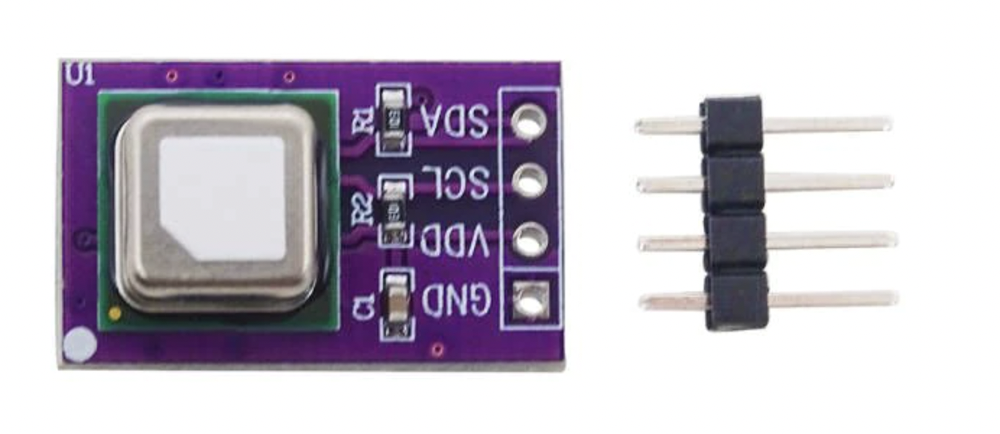

# garden local 2.0 weather station firmware
## hardware
- [adafruit feather 32u4 with LoRa Radio Module](https://learn.adafruit.com/adafruit-feather-32u4-radio-with-lora-radio-module/overview)<br/>

- [sensirion I2C SCD40](https://ko.aliexpress.com/item/1005004316508788.html?spm=a2g0o.detail.1000014.7.1c5b59b9uRs3u7&gps-id=pcDetailBottomMoreOtherSeller&scm=1007.40000.267768.0&scm_id=1007.40000.267768.0&scm-url=1007.40000.267768.0&pvid=4ac62bb6-6ceb-481c-b12b-c883ec61137f&_t=gps-id%3ApcDetailBottomMoreOtherSeller%2Cscm-url%3A1007.40000.267768.0%2Cpvid%3A4ac62bb6-6ceb-481c-b12b-c883ec61137f%2Ctpp_buckets%3A668%232846%238111%23419&pdp_ext_f=%7B%22sku_id%22%3A%2212000028729263084%22%2C%22sceneId%22%3A%2230050%22%7D&pdp_npi=2%40dis%21KRW%2118486.0%2118486.0%21%21%21%21%21%40210312cd16642435934963749e0ddc%2112000028729263084%21rec&gatewayAdapt=glo2kor)<br/>

- [sparkfun gator:soil](https://www.sparkfun.com/products/15272)<br/>


## dependencies
- [sensirion I2C SCD4X library](https://github.com/Sensirion/arduino-i2c-scd4x)
- [radiohead arduino library](https://www.airspayce.com/mikem/arduino/RadioHead/index.html)

## LoRa PROTOCOL

### rPi -> feather
``` C++
[0] '/'
[1] DEVICE_ID
[2] 'F'  // run fog
[3] '1'  // 1 : run - 1 : off
[4] '\0'
```

### feather -> rPi

``` c++
//uint8_t reply[17];
reply[0] = '/';
reply[1] = DEVICE_ID;               // device ID. int? byte? hmm...
reply[2] = temperature.numBin[0];   // 32bit float bin
reply[3] = temperature.numBin[1];
reply[4] = temperature.numBin[2];
reply[5] = temperature.numBin[3];
reply[6] = humidity.numBin[0];      // 32bit float bin
reply[7] = humidity.numBin[1];
reply[8] = humidity.numBin[2];
reply[9] = humidity.numBin[3];
reply[10] = co2.numBin[0];          // 16bit int bin
reply[11] = co2.numBin[1];
reply[12] = soil.numBin[0];
reply[13] = soil.numBin[1];
if (isCharging) reply[14] = 1;      // chargning status bin
else            reply[15] = 0;
reply[16] = 0;
```