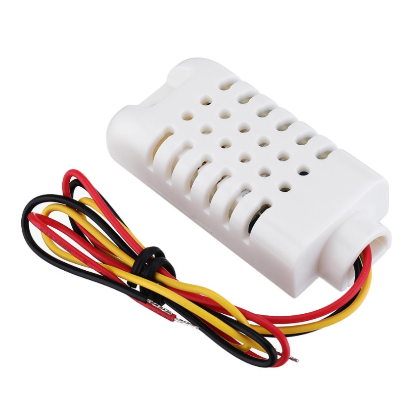

# garden local 2.0 weather station firmware
## hardware
- [adafruit feather 32u4 with LoRa Radio Module](https://learn.adafruit.com/adafruit-feather-32u4-radio-with-lora-radio-module/overview)<br/>

- [DHT22](https://www.techshenzhen.com/goods/goods_view.php?goodsNo=1000004069)<br/>

- [sparkfun gator:soil](https://www.sparkfun.com/products/15272)<br/>


## dependencies
- [DHT22 library](https://github.com/adafruit/DHT-sensor-library)
- [radiohead arduino library](https://www.airspayce.com/mikem/arduino/RadioHead/index.html)

## FIRMWARE
### DEVICE ID
- edit `DEVICE_ID` value [here](https://github.com/gardenlocal/feather-weatherReportLoRa/blob/bd03f9be059233e7553800a424d56836bf4526c5/featherFirmware/featherFirmware.ino#L11)

## LoRa PROTOCOL

### rPi -> feather
- set manual mode (0 : auto, 1:manual)
``` C++
[0] '/'
[1] DEVICE_ID
[2] 'M'  // run fog in manual
[3] '1'  // 1 : manual - 0 : auto
[4] '\0'
```

- set spray in seconds
```C++
[0] '/'
[1] DEVICE_ID
[2] 'S'  // run fog in manual
[3] byte(5)  // 5 seconds
[4] '\0'
```

- set interval in munites
 ```C++
[0] '/'
[1] DEVICE_ID
[2] 'I'  // run fog in manual
[3] byte(60)  // 60 minutes
[4] '\0'
```

- set force running in manual
``` C++
[0] '/'
[1] DEVICE_ID
[2] 'F'  // run fog in manual
[3] '1'  // 1 : run - 0 : off
[4] '\0'
```

### feather -> rPi packet structure

``` c++
uint8_t reply[15];
reply[0] = '/';
reply[1] = 'R'; // report packet
reply[2] = DEVICE_ID;               // device ID. int? byte? hmm...
reply[3] = temperature.numBin[0];   // 32bit float bin
reply[4] = temperature.numBin[1];
reply[5] = temperature.numBin[2];
reply[6] = temperature.numBin[3];
reply[7] = humidity.numBin[0];      // 32bit float bin
reply[8] = humidity.numBin[1];
reply[9] = humidity.numBin[2];
reply[10] = humidity.numBin[3];
reply[11] = soil.numBin[0];         // 16bit int bin
reply[12] = soil.numBin[1];
if (isCharging) reply[13] = 1;      // chargning status bin
else            reply[13] = 0;
reply[14] = 0;
```